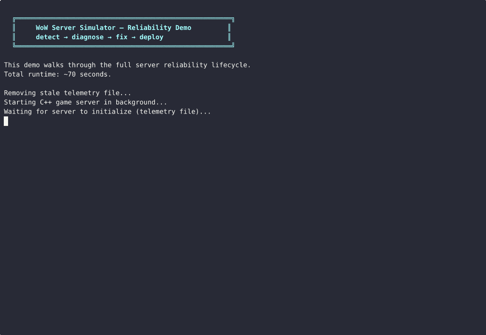
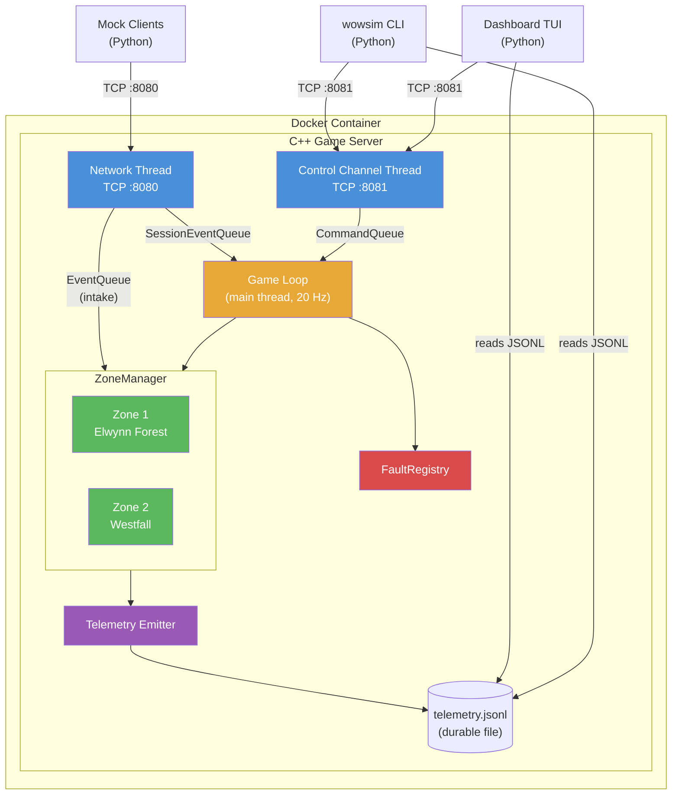
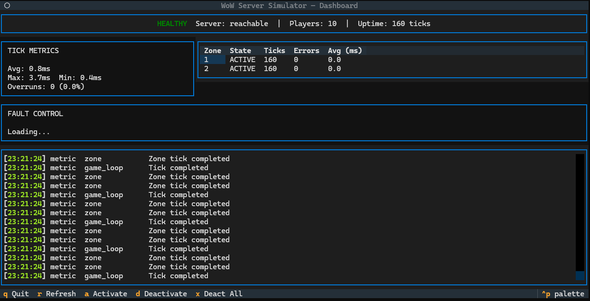
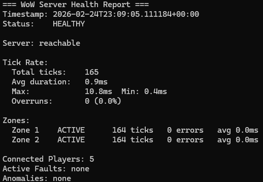
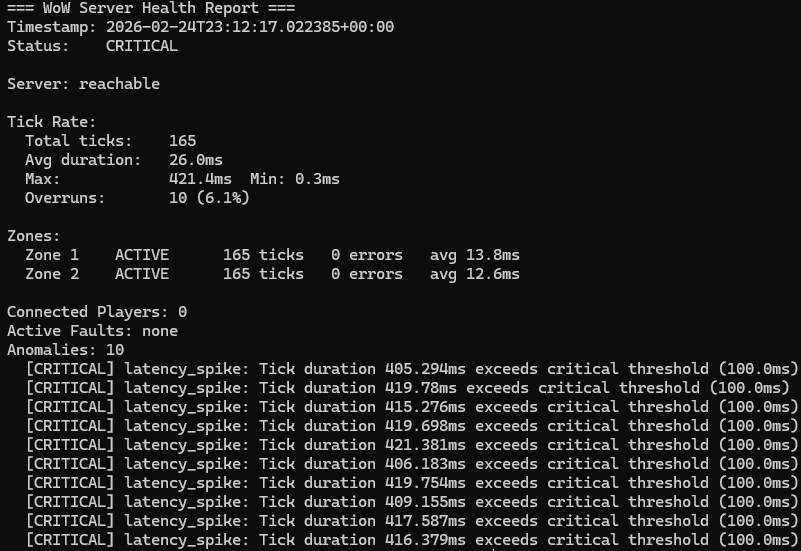
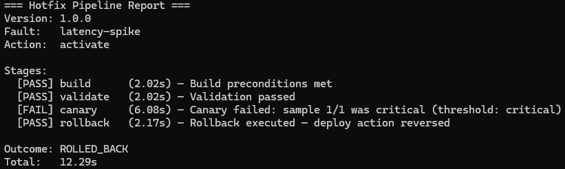

# WoW Server Simulator


A C++17 game server with Python reliability tooling that demonstrates server reliability engineering for the **World of Warcraft Server** team at Blizzard Entertainment. The project simulates a simplified WoW game server — fixed-rate tick loop, player sessions, combat, spells, zone isolation — then layers fault injection, telemetry, and automated recovery on top, showcasing the full lifecycle of **detect, diagnose, fix, deploy**.


*Full reliability lifecycle demo: baseline → fault injection → diagnosis → fix → canary deploy → rollback (70 seconds, sped up 3x). See [Capture Guide](docs/CAPTURE_GUIDE.md) for recording instructions.*

## Why This Project

Every feature maps directly to a requirement from the WoW Server Reliability Engineer role:

| Job Requirement | Project Demonstration | Specific Evidence |
|---|---|---|
| C++ and Python fluency | Core server in C++17, all tooling in Python | Modern C++17 with RAII, idiomatic async Python, Pydantic v2 models |
| Strong debugging skills | Fault injection + diagnosis workflow | 8 failure scenarios with log-driven root cause analysis |
| Networking / distributed systems | Multi-client TCP server with session management | Async socket programming, concurrent connections, thread-safe queues |
| Reliability mindset | Health checks, automated rollback, failure prediction | Canary deployments, zone crash isolation, graceful degradation |
| Shepherd hotfixes dev to live | Simulated deployment pipeline | Multi-stage rollout (build → validate → canary → promote/rollback) |
| WoW domain knowledge | Authentic game mechanics simulation | Spell casts with GCD, combat ticks, threat tables, zone isolation — modeled on real WoW systems |
| Automation to reduce toil | Python tooling suite | 9 CLI modules: log analysis, anomaly detection, benchmarks, deployment orchestration, interactive demo |

## Key Features

### Game Server Core

C++17 TCP server running a fixed 20 Hz tick loop (matching WoW's actual server tick rate). Handles concurrent player connections with a two-thread model: network thread for I/O, main thread for deterministic game state. Implements spell casts with GCD enforcement, combat with armor/resistance mitigation and threat tables, movement with cast cancellation, and zone-isolated processing.

### Fault Injection Framework

8 runtime-injectable failure scenarios (F1–F8) controllable via a separate TCP control channel. Ranges from simple latency spikes and session crashes to complex cascading zone failures, slow memory leaks, split-brain partitions, and thundering herd reconnection storms. Faults compose with zone targeting, auto-expiry, and per-tick deduplication so global faults fire exactly once regardless of zone count.

### Reliability Lifecycle Demo

Two demo modes: a scripted 70-second walkthrough (`scripts/demo.sh`) for non-interactive recording, and an **interactive demo** (`wowsim demo`) that starts the server, opens the dashboard with guided suggestions, and lets you explore the full **detect → diagnose → fix → deploy** cycle at your own pace. The suggestion bar adapts to current state — prompting you to spawn players, inject faults, observe metrics, recover, and run the deployment pipeline.

### Python Tooling Suite

9 CLI modules under the `wowsim` command: log parser with anomaly detection, fault injection client, health check reporter, mock client spawner, monitoring dashboard, deployment pipeline, and performance benchmarks. All built with Click, Pydantic v2, and async I/O.

### Monitoring Dashboard

Textual-based TUI with auto-refreshing panels for tick metrics, zone health, active faults, and a scrolling event log. Worker-thread health refresh for non-blocking sync I/O. Keyboard shortcuts for spawning clients (`s`) with configurable duration (10s/30s/60s/persistent), graceful despawn (`k`), fault picker modal (`a`), deactivation (`d`/`x`), and pipeline execution (`p`). Guided suggestion bar adapts to current state — showing despawn guidance when clients are running and next-step prompts throughout the reliability lifecycle.

### Deployment Pipeline

Staged hotfix lifecycle (build → validate → canary → promote/rollback) composing health checks and fault triggers. Canary health sampling with configurable rollback thresholds. Maps fault activation to "deploy" and deactivation to "fix" for a self-contained reliability demo.

## Architecture



Three threads handle distinct responsibilities: the **network thread** accepts game client connections on port 8080, the **control channel thread** accepts operator commands on port 8081, and the **main thread** runs the 20 Hz game loop. Three thread-safe queues (SessionEventQueue, EventQueue, CommandQueue) bridge the threads. Python tooling connects externally via TCP and reads the durable JSONL telemetry log for observability.


*Textual TUI dashboard showing real-time server health. See [Capture Guide](docs/CAPTURE_GUIDE.md) for recording instructions.*

**Additional architecture diagrams:** [Thread Model](docs/diagrams/thread-model.md) | [Tick Pipeline](docs/diagrams/tick-pipeline.md) | [Session State Machine](docs/diagrams/session-state-machine.md) | [Python Tool Composition](docs/diagrams/python-tools.md)

## Demo

### Quick Demo (70 seconds)

The demo script walks through the full reliability lifecycle — no manual intervention required:

```bash
bash scripts/demo.sh
```

| Phase | Duration | What Happens |
|-------|----------|-------------|
| 1. Baseline | ~10s | Spawns 5 simulated players, verifies healthy server |
| 2. Break | ~5s | Injects 200ms latency spike (4x tick budget overrun) |
| 3. Diagnose | ~5s | Scans telemetry for anomalies, identifies root cause |
| 4. Fix | ~10s | Deactivates the fault, verifies recovery |
| 5. Pipeline | ~30s | Runs canary deployment with auto-rollback |
| 6. Summary | ~10s | Final health check and lifecycle recap |

**Prerequisites:** built server binary + Python venv with `wowsim` installed (see [Quick Start](#quick-start)).


*Phase 1: Healthy baseline — 5 players, both zones active, zero overruns. See [Capture Guide](docs/CAPTURE_GUIDE.md) for recording instructions.*


*Phases 2-3: Fault injection — CRITICAL status, latency anomalies detected in telemetry. See [Capture Guide](docs/CAPTURE_GUIDE.md) for recording instructions.*


*Phase 5: Canary deployment detects degradation and triggers automatic rollback. See [Capture Guide](docs/CAPTURE_GUIDE.md) for recording instructions.*

### Sample Output

**Health Report (Healthy)**

```
=== WoW Server Health Report ===
Timestamp: 2026-02-24T12:00:05.123456+00:00
Status:    HEALTHY

Server: reachable

Tick Rate:
  Total ticks:    200
  Avg duration:   3.2ms
  Max:            8.1ms  Min: 1.0ms
  Overruns:       0 (0.0%)

Zones:
  Zone 1    ACTIVE      200 ticks   0 errors   avg 2.8ms
  Zone 2    ACTIVE      200 ticks   0 errors   avg 3.0ms

Connected Players: 5
Active Faults: none
Anomalies: none
```

**Health Report (Critical — Latency Spike Active)**

```
=== WoW Server Health Report ===
Timestamp: 2026-02-24T12:01:15.789012+00:00
Status:    CRITICAL

Server: reachable

Tick Rate:
  Total ticks:    400
  Avg duration:   105.3ms
  Max:            212.7ms  Min: 1.1ms
  Overruns:       187 (46.8%)

Zones:
  Zone 1    ACTIVE      400 ticks   0 errors   avg 102.1ms
  Zone 2    ACTIVE      400 ticks   0 errors   avg 104.8ms

Connected Players: 5
Active Faults: latency_spike
Anomalies: 187
  [CRITICAL] latency_spike: Tick duration 210.3ms exceeds critical threshold (100.0ms)
  [CRITICAL] latency_spike: Tick duration 208.1ms exceeds critical threshold (100.0ms)
  [CRITICAL] latency_spike: Tick duration 211.5ms exceeds critical threshold (100.0ms)
```

**Anomaly Detection**

```
Anomalies (4)
========================================
  [CRITICAL] latency_spike: Tick duration 210.3ms exceeds critical threshold (100.0ms)
           at 2026-02-24T12:01:10.500000+00:00
  [CRITICAL] latency_spike: Tick duration 208.1ms exceeds critical threshold (100.0ms)
           at 2026-02-24T12:01:10.550000+00:00
  [CRITICAL] error_burst: 6 errors within 10.0s (threshold: 5)
           at 2026-02-24T12:01:10.600000+00:00
  [WARNING] unexpected_disconnect: Client session 42 disconnected unexpectedly
           at 2026-02-24T12:01:11.200000+00:00
```

**Pipeline Rollback Report**

```
=== Hotfix Pipeline Report ===
Version: hotfix-20260224-120200
Fault:   latency_spike
Action:  activate

Stages:
  [PASS] build      (0.15s) — Build preconditions met
  [PASS] validate   (0.12s) — Validation passed
  [FAIL] canary     (5.23s) — Canary failed: sample 2/3 was critical (threshold: degraded)
  [PASS] rollback   (0.08s) — Rollback executed — deploy action reversed

Outcome: ROLLED_BACK
Total:   5.58s
```

## Fault Scenarios

8 injectable failure modes covering a range of real-world server reliability challenges:

| ID | Name | Mode | Description | Detection Signal |
|----|------|------|-------------|-----------------|
| F1 | Latency Spike | Tick-scoped | Adds configurable delay (default 200ms) to tick processing | Tick rate drops, overrun percentage spikes |
| F2 | Session Crash | Tick-scoped | Force-removes a random player entity from a zone | Unexpected disconnect in telemetry |
| F3 | Event Queue Flood | Tick-scoped | Injects multiplier * entity_count synthetic events | Queue depth spike, processing lag |
| F4 | Memory Pressure | Ambient | Allocates and holds configurable MB in 1MB chunks | Memory usage counter spike |
| F5 | Cascading Zone Failure | Tick-scoped | Crashes source zone, floods target zone with synthetic events | Multi-zone alert pattern, zone CRASHED state |
| F6 | Slow Leak | Tick-scoped | Increments tick processing delay by N ms every M ticks | Gradual tick rate degradation over time |
| F7 | Split Brain | Tick-scoped | Injects phantom NPCs with zone-dependent divergent positions | State divergence across zones |
| F8 | Thundering Herd | Tick-scoped | Mass disconnect then simultaneous reconnect after delay | Auth system overload, reconnection storm |


*F5 Cascading Zone Failure: zone 1 crashes, players redistribute to zone 2, triggering overload. See [Capture Guide](docs/CAPTURE_GUIDE.md) for recording instructions.*

## Quick Start

### Docker (recommended)

```bash
git clone <repo-url> && cd wow-server-sim
docker compose up --build
```

This builds the C++ server, installs Python tooling, and runs the full
70-second reliability lifecycle demo automatically — detect, diagnose, fix,
deploy with colored narration. No manual setup required.

To run just the server (for interactive use with Python tools):

```bash
docker compose --profile server up --build server
```

The server exposes:
- **8080** — Game traffic (TCP)
- **8081** — Control channel for fault injection (TCP)
- **9090** — Telemetry broadcast (UDP)

### Python Tooling

```bash
bash scripts/setup_venv.sh
source .venv/bin/activate   # or .venv/Scripts/activate on Windows
wowsim --help
```

Available commands:

| Command | Description |
|---------|-------------|
| `wowsim health` | Check server health (tick rate, zones, anomalies) |
| `wowsim inject-fault` | Inject/deactivate fault scenarios via control channel |
| `wowsim parse-logs` | Analyze telemetry logs, detect anomalies |
| `wowsim spawn-clients` | Generate simulated player traffic |
| `wowsim dashboard` | Launch the monitoring TUI |
| `wowsim deploy` | Run the hotfix deployment pipeline |
| `wowsim benchmark` | Performance benchmark suite |
| `wowsim demo` | Interactive demo: start server + guided dashboard |

### Build From Source

```bash
bash scripts/build.sh
./build/wow-server-sim
```

### Run Tests

```bash
# All tests (C++ + Python)
bash scripts/run_all_tests.sh

# C++ only
cd build && ctest --output-on-failure

# Python only
source .venv/bin/activate
python -m pytest tests/python/ -v

# Integration tests (requires running server)
python -m pytest tests/python/integration/ -v
```

## Telemetry

The server emits structured JSONL telemetry to `telemetry.jsonl`. Every line is a self-contained JSON object:

```json
{"timestamp":"2026-02-24T12:00:00.050Z","type":"metric","component":"game_loop","message":"Tick completed","data":{"tick":1,"duration_ms":3.2,"overrun":false}}
{"timestamp":"2026-02-24T12:00:00.050Z","type":"event","component":"zone","message":"Zone tick completed","data":{"zone_id":1,"duration_ms":2.8,"entity_count":3}}
{"timestamp":"2026-02-24T12:00:00.100Z","type":"error","component":"zone","message":"Zone tick exception","data":{"zone_id":1,"error":"simulated crash"}}
```

| Field | Description |
|-------|-------------|
| `timestamp` | ISO 8601 with millisecond precision |
| `type` | `metric`, `event`, `error`, or `health` |
| `component` | Emitting subsystem (`game_loop`, `zone`, `session`, `game_server`, `fault`) |
| `message` | Human-readable description |
| `data` | Structured payload (varies by type/component) |

## Project Stats

- **267** C++ tests (GoogleTest) — server core, events, zones, faults, control channel
- **173** Python tests (pytest) — CLI tools, models, formatting, orchestration, dashboard, benchmarks
- **16** integration tests — connection lifecycle, fault injection/recovery, end-to-end
- **29** Architecture Decision Records (ADRs)
- **8** fault injection scenarios (F1–F8)
- **5** architecture diagrams (Mermaid)
- **9** CLI modules under `wowsim`
- **20 Hz** tick rate matching WoW's actual server tick

## Tech Stack

| Layer | Technology |
|-------|-----------|
| Server | C++17, standalone Asio, nlohmann/json |
| Tooling | Python 3.11+, Click CLI, Pydantic v2, Textual TUI |
| Testing | GoogleTest (C++), pytest (Python) |
| Container | Docker, docker-compose |
| CI | GitHub Actions |

## Documentation

- [Architecture](docs/ARCHITECTURE.md) — Component design, data flow, concurrency model
- [Decision Records](docs/DECISIONS.md) — 29 ADRs for all architectural choices
- [Product Requirements](docs/PRD.md) — Full project scope, skills mapping, success criteria
- [Changelog](docs/CHANGELOG.md) — Running log of all changes
- [Capture Guide](docs/CAPTURE_GUIDE.md) — Instructions for recording screenshots and GIFs

## Project Status

Phase 2 complete — all success criteria met:

- Server handles 50+ concurrent mock players without tick rate degradation
- All 8 fault scenarios produce detectable telemetry signatures
- Python tools correctly identify and surface all injected faults
- Full demo walkthrough runs end-to-end in ~70 seconds
- All tests pass in CI (GitHub Actions)
- Documentation is complete and accurate
