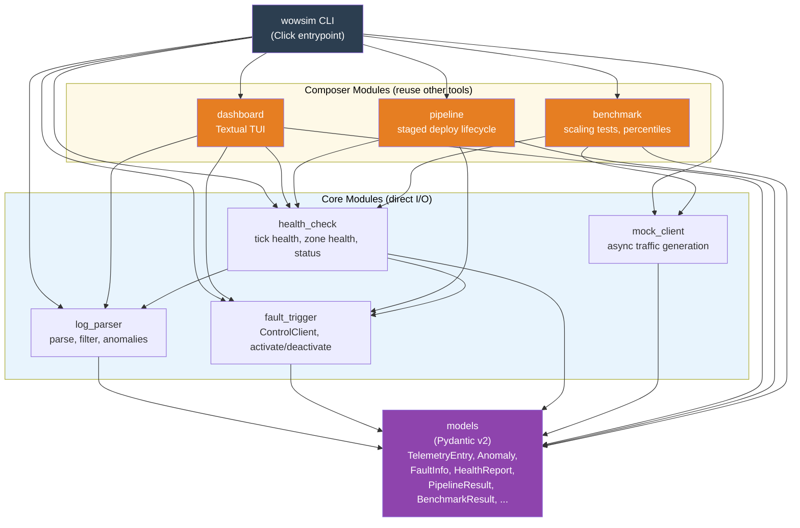

# Python Tool Composition

> Part of the [Architecture Documentation](../ARCHITECTURE.md).

The Python tooling follows a layered composition pattern. Four **core modules** handle direct I/O: `log_parser` reads JSONL files, `fault_trigger` talks to the C++ control channel via TCP, `mock_client` generates async traffic, and `health_check` aggregates data from log_parser and fault_trigger. Three **composer modules** (orange) build higher-level workflows by reusing core modules: `dashboard` combines health_check + log_parser + fault_trigger into a live TUI, `pipeline` orchestrates health_check + fault_trigger into a staged deployment lifecycle, and `benchmark` composes mock_client + health_check into automated scaling tests. All modules share a common `models` layer (Pydantic v2) ensuring type-safe data exchange across the toolkit.
