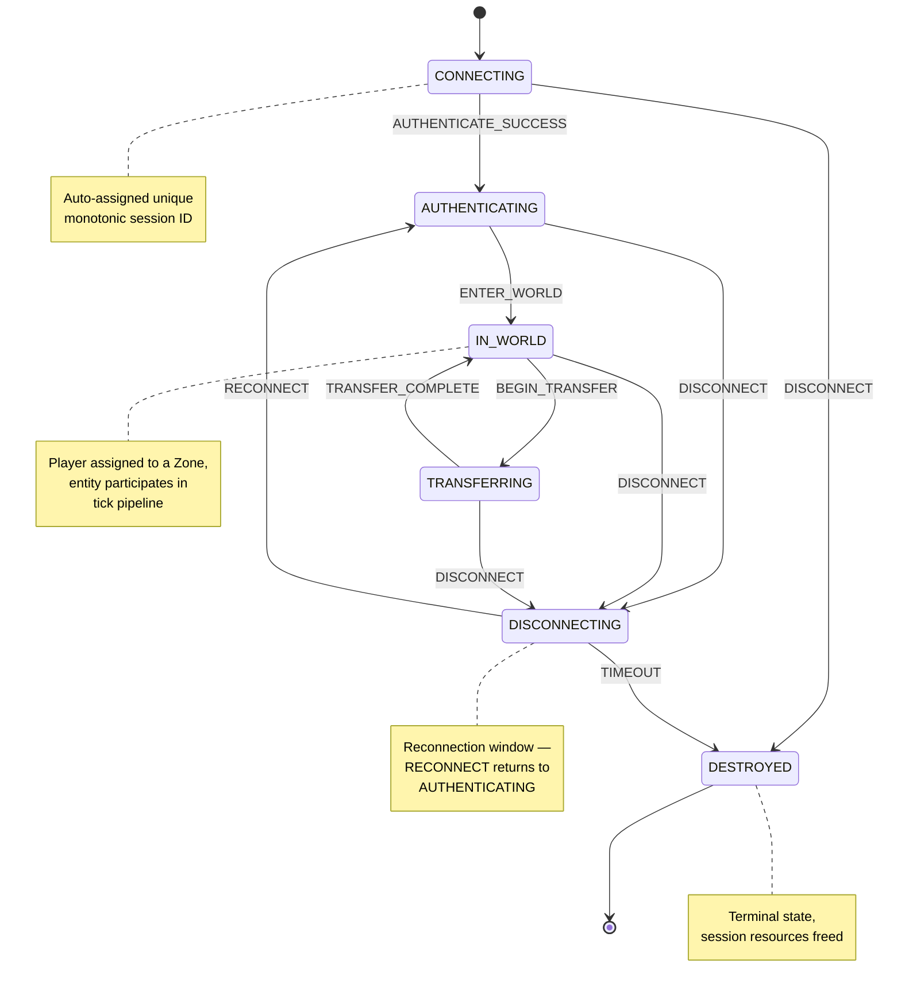

# Session State Machine

> Part of the [Architecture Documentation](../ARCHITECTURE.md).

The session lifecycle tracks a player's connection through 6 states and 10 transitions, implemented as a `constexpr` transition table in `wow::Session`. A new connection starts in **CONNECTING** and progresses through **AUTHENTICATING** into **IN_WORLD** where the player's entity participates in zone tick processing. The **TRANSFERRING** state supports zone transfers (e.g., moving between Elwynn Forest and Westfall). **DISCONNECTING** provides a reconnection window — the `RECONNECT` event returns the session to `AUTHENTICATING` rather than requiring a fresh connection. The `TIMEOUT` event in DISCONNECTING leads to the terminal **DESTROYED** state where all session resources are freed.
