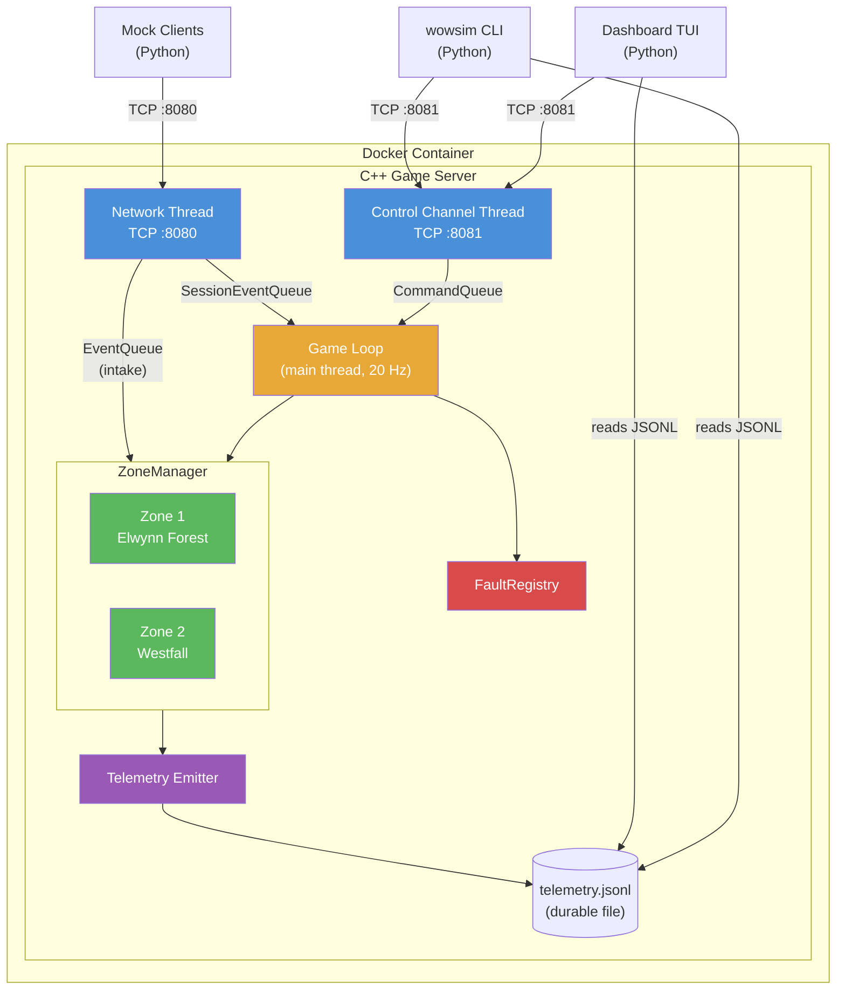

# System Overview

> Part of the [Architecture Documentation](../ARCHITECTURE.md).

The system runs inside a Docker container with the C++ game server as its core. Three threads handle distinct responsibilities: the **network thread** accepts game client connections on port 8080, the **control channel thread** accepts operator commands on port 8081, and the **main thread** runs the 20 Hz game loop. Three thread-safe queues (SessionEventQueue, EventQueue, CommandQueue) bridge the network threads to the game loop, which owns all mutable game state including the FaultRegistry and ZoneManager. Python tooling connects externally via TCP and reads the durable JSONL telemetry log file for observability.
