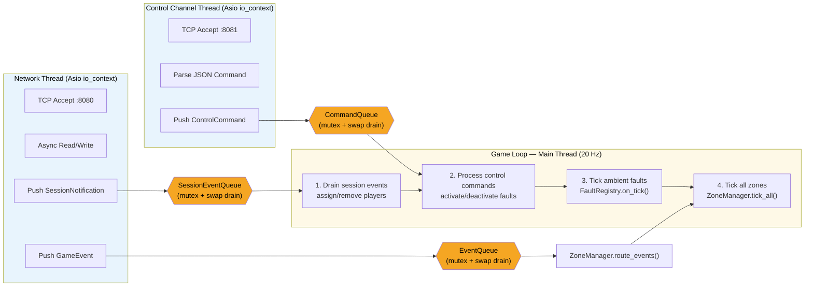

# Thread Model

> Part of the [Architecture Documentation](../ARCHITECTURE.md).

The MVP uses three threads with strict ownership boundaries. The **network thread** and **control channel thread** each run their own Asio `io_context` and only produce data — they never touch game state directly. Three thread-safe queues (all using the same mutex + swap-drain pattern) bridge data to the **game loop on the main thread**, which owns all mutable state. The game loop processes queues in a fixed order each tick: session events first (player join/leave), then control commands (fault activation), then ambient fault ticks, and finally zone ticks. This ordering ensures faults take effect on the same tick they are activated.
