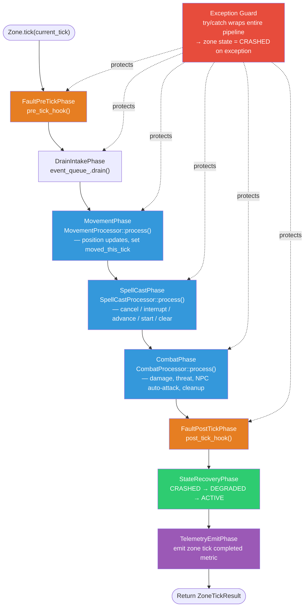

# Tick Pipeline (Per Zone)

> Part of the [Architecture Documentation](../ARCHITECTURE.md).

Each zone executes an 8-phase pipeline on every tick. The two **fault injection points** (orange) — `FaultPreTickPhase` and `FaultPostTickPhase` — are hooks set by the FaultRegistry, allowing faults like latency spikes (F1) and event floods (F3) to fire at controlled moments. The three **game processing phases** (blue) run in a fixed order: movement first (so `moved_this_tick` is set before spell processing checks it), then spell casts, then combat. An **exception guard** wraps the entire pipeline in `try/catch` — if any phase throws, the zone transitions to CRASHED without affecting other zones. The **state recovery phase** (green) promotes zones back toward ACTIVE on successive successful ticks.
